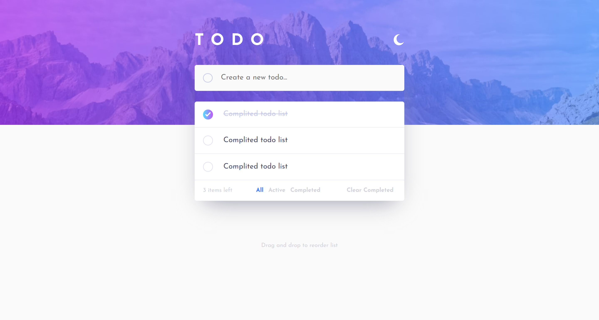
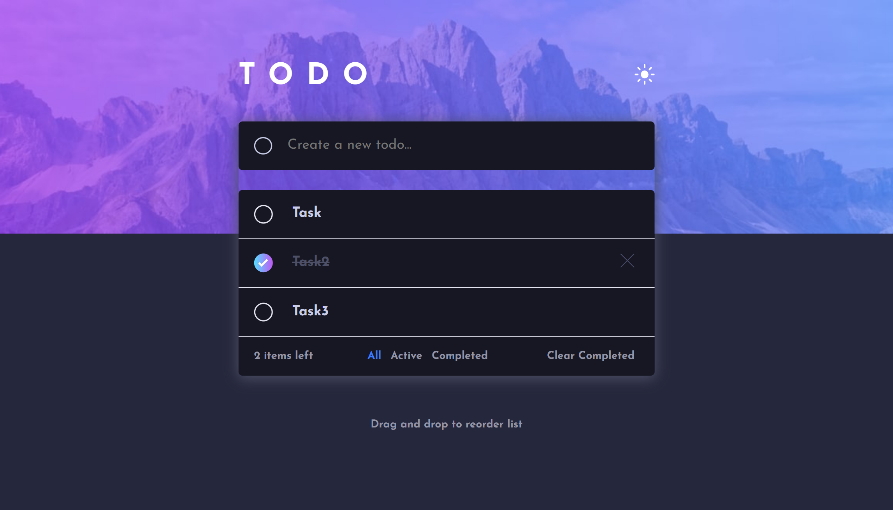

# Project : TODO list

## Screen

## Deploy [link](https://zesty-frangollo-e537ef.netlify.app/)

## Source code [link](https://github.com/VlaRu/frontend-challenge/tree/feature/frontend-challenge)

## Stack:

- Vite
- React
- contextApi
- Redux/RTK
- CSS
- Eslint
- Prettier

## Realized

- See hover states for all interactive elements on the page
- Add new todos to the list
- Mark todos as complete
- Delete todos from the list
- Filter by all/active/complete todos
- Clear all completed todos
- **Bonus**: Drag and drop to reorder items on the list

### additional
- implement switching theme

## Install

#### follow to branch 'feature'

``
cd frontend-challenge
``

install dependencies

``
npm i
``

``
npm run dev
``

``
npm run build
``
